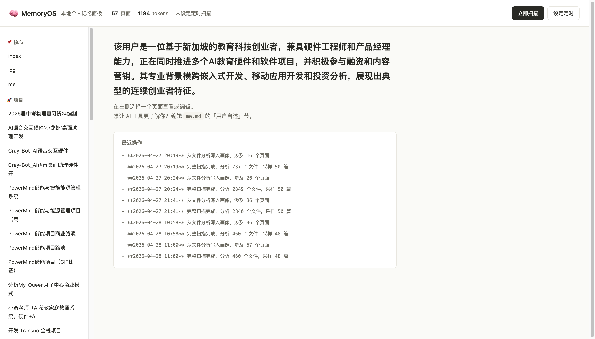
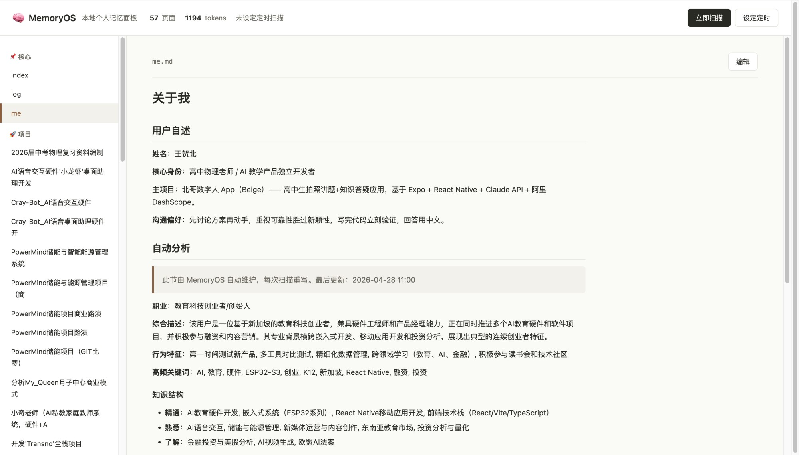
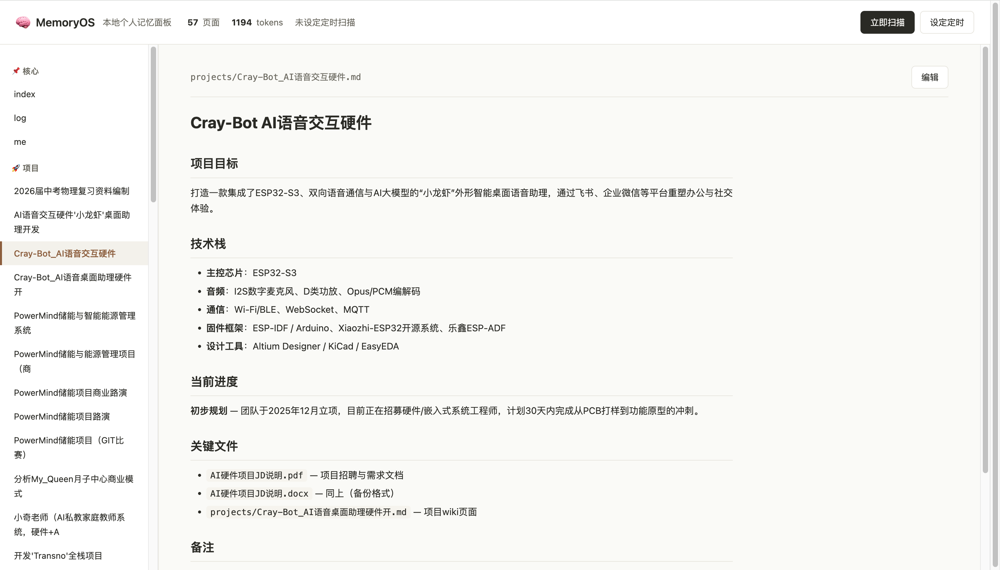
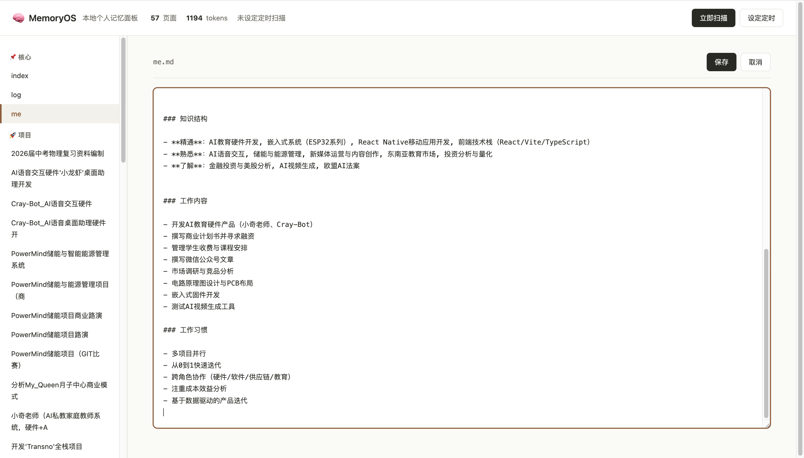
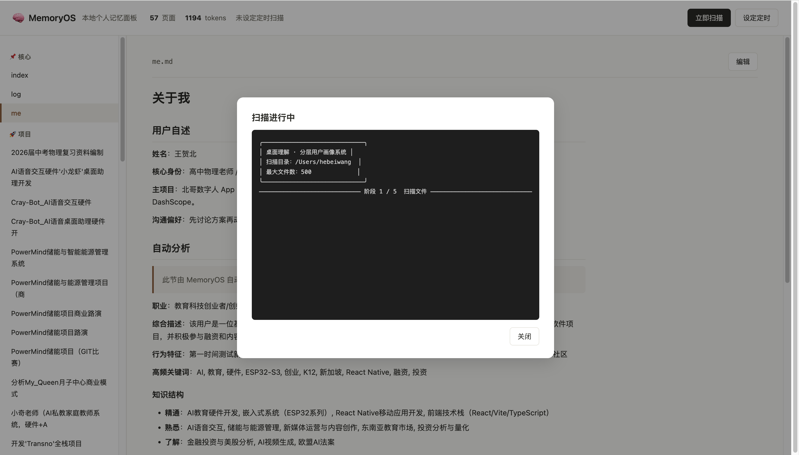

# MemoryOS

> 让所有 AI 工具永久认识你的本地个人记忆系统

[](https://opensource.org/licenses/MIT)
[](https://www.python.org/downloads/)
[]()



> 上图是 MemoryOS Web UI 主面板。**57 个 Wiki 页面，1194 token 个人上下文**，每次对话自动注入到任意 AI 工具。

<details>
<summary><b>📸 更多截图</b>（点击展开）</summary>

### 个人画像页（me.md）

`## 用户自述`节由你手动维护、永不被覆盖；`## 自动分析`节由扫描后自动重写。



### 项目档案（自动生成）

每个项目自动生成 300-400 字的结构化档案：项目目标、技术栈、当前进度、关键文件。



### 编辑模式

任何页面都可以直接在 Web UI 编辑，`Cmd+S` 保存。



### 立即扫描

点击「立即扫描」按钮，弹窗实时显示扫描日志。



</details>

---

## 解决什么问题

每打开一个新 AI 软件都要重新自我介绍一遍——「我是谁、我做什么、最近在做什么项目」。

**MemoryOS 的方案**：在你电脑本地建立一个**结构化个人记忆库**，然后通过三种方式让所有 AI 工具自动用上它——配置一次，永久生效。

```
你的电脑文件 → 扫描分析 → 本地 Wiki 知识库
                              ↓ 自动注入
                         所有 AI 工具
       (Claude Code / Cursor / OpenClaw / Cherry Studio …)
```

---

## 核心特性

- 🔒 **完全本地**：数据存于 `~/.memoryos/`，不上传到任何第三方服务器
- 🤖 **支持 16+ 个 AI 厂商**：DeepSeek、通义、智谱、Kimi、豆包、文心、Claude、OpenAI、Gemini、Grok、Mistral、Groq、本地 Ollama …
- 🧩 **3 种接入协议**：MCP（IDE 类）+ HTTP 代理（GUI 类）+ Web UI（手动管理）
- 📝 **可读可改的 Wiki**：Markdown 格式，可手动编辑、可版本管理
- 🔄 **跨平台**：macOS / Windows / Linux 三平台原生支持
- 💰 **成本极低**：建一次 90GB 文件的画像约 ¥3-5（一次性）

---

## 支持的 AI 厂商（一键切换）

只需修改 `.env` 中的 `AI_PROVIDER` 字段，全部 16 个厂商可任选：

### 国际
`openai` · `anthropic` · `gemini` · `grok` · `mistral` · `groq` · `azure-openai`

### 国内
`deepseek` · `dashscope`（通义）· `zhipu`（GLM）· `moonshot`（Kimi）· `doubao`（豆包）· `ernie`（文心）· `minimax` · `stepfun`（阶跃星辰）

### 本地
`ollama` · `lmstudio`

### 其他
`custom`（任何 OpenAI 兼容服务）

---

## 支持的 AI 工具

完整接入指南见 **[INTEGRATIONS.md](INTEGRATIONS.md)**。

| 工具 | 接入协议 | 一句话配置 |
|------|---------|-----------|
| Claude Code / Claude Desktop | MCP | 自动注册 |
| Cursor | MCP / 代理 | `~/.cursor/mcp.json` |
| Codex CLI | 代理 | `OPENAI_BASE_URL=http://localhost:8765/v1` |
| Cline / Continue.dev | MCP / 代理 | base_url 改为 `localhost:8765/v1` |
| OpenClaw / QClaw / Hermes | 代理 | API 地址改为 `localhost:8765/v1` |
| Cherry Studio / Chatbox | 代理 | 同上 |
| 任何 OpenAI 兼容工具 | 代理 | 同上 |

---

## 工作原理

```
┌─────────────────────────────────────────────────────────────┐
│                        你的电脑                              │
│                                                             │
│  ┌──────────┐  ┌──────────┐  ┌──────────┐                  │
│  │ Claude   │  │  Cursor  │  │ OpenClaw │   ...            │
│  │  Code    │  │          │  │          │                  │
│  └────┬─────┘  └────┬─────┘  └────┬─────┘                  │
│       │ MCP         │ MCP/代理     │ HTTP 代理                │
│       ▼             ▼             ▼                         │
│  ┌─────────────────────────────────────────┐               │
│  │   MemoryOS · localhost:8765 (代理)      │               │
│  │   按 model 名自动路由到对应厂商         │               │
│  │   自动注入个人上下文（≤1500 token）     │               │
│  └────────────────┬────────────────────────┘               │
│                   ▼                                         │
│  ┌──────────────────────────────────────┐                  │
│  │  Wiki 知识库（Markdown）              │                  │
│  │  ├── me.md  （含用户自述节）          │                  │
│  │  ├── projects/                       │                  │
│  │  ├── interests/                      │                  │
│  │  └── tools/                          │                  │
│  └──────────────────────────────────────┘                  │
└─────────────────────────────────────────────────────────────┘
                       │ 转发到真实 AI 服务
        ┌──────────────┼──────────────┐
        ▼              ▼              ▼
   anthropic       openai         deepseek
                        ...
```

---

## 快速开始

### macOS / Linux

```bash
git clone https://github.com/hebeiwang353-bit/personal-wiki.git
cd personal-wiki
bash install.sh
```

### Windows

```powershell
git clone https://github.com/hebeiwang353-bit/personal-wiki.git
cd personal-wiki
.\install.ps1
```

### 配置 API Key

编辑 `~/.memoryos/.env`：

```bash
# 选你正在用的厂商
AI_PROVIDER=deepseek
AI_API_KEY=sk-xxxxxxxx
```

完整厂商清单见 [`.env.example`](.env.example)。

### 第一次扫描

```bash
source ~/.memoryos/venv/bin/activate
PYTHONPATH=~/.memoryos/src python ~/.memoryos/src/main.py --max-files 2000 --no-embed --skip-confirm
```

约 2-5 分钟扫完（扫描文件越多，AI 对你的了解越深）。看到「✓ Wiki 已写入」就成功了。

### 接入你的 AI 工具

参考 [INTEGRATIONS.md](INTEGRATIONS.md) 的对应章节。最简版本：

- **支持 MCP 的工具**（Claude Code / Cursor）：`install.sh` 已自动注册
- **其他工具**：把 API 地址改为 `http://localhost:8765/v1`

---

## Wiki 结构

```
~/.memoryos/wiki/
├── index.md             导航目录
├── me.md                ← 核心画像（用户自述节 + 自动分析节）
├── projects/            正在做的项目（自动生成详细页面）
├── interests/           兴趣领域
├── tools/               常用工具链
└── log.md               操作日志
```

`me.md` 中的 `## 用户自述` 节是**手动维护、永不被自动覆盖**的。建议在这里写：
- 你的真实身份和职业
- 主项目和技术栈
- 沟通偏好（让 AI 用什么语气回答你）

---

## 隐私说明

| 数据类型 | 是否离开本机 |
|---------|------------|
| 文件原文 | ❌ 不上传 |
| 文件提取的文本片段 | ⚠️ 扫描时上传到你配置的 AI 服务（建画像用） |
| 浏览器历史标题 | ⚠️ 扫描时上传到你配置的 AI 服务（前 150 条） |
| 生成的 Wiki | ❌ 永久存于本地 |
| 每次对话的上下文注入 | ⚠️ ≤1500 token 一起发给 AI |

**MemoryOS 本身没有任何远程服务器**——这个项目根本没有自己的服务端。

如果你完全不想任何文件内容离开本机，把 `AI_PROVIDER` 设为 `ollama`（需要本地装 Ollama）。

---

## 命令速查

```bash
# 立即扫描（install.sh 自动设置，通常无需手动运行）
PYTHONPATH=. python main.py --max-files 2000 --no-embed --skip-confirm

# 修改定时扫描时间（安装时已默认设为 11:00）
PYTHONPATH=. python -m memoryos_mcp.scheduler --set "22:00"

# 查看定时状态
PYTHONPATH=. python -m memoryos_mcp.scheduler --status

# 启动代理（开机自启已由 install.sh 注册）
PYTHONPATH=. python proxy/proxy_server.py

# 启动 Web UI
PYTHONPATH=. python web/server.py
# → http://localhost:8766
```

---

## 路线图

### Phase 1（已完成）
- [x] 文件扫描 + 提取（PDF/Word/Excel/HTML/代码 等 20+ 格式）
- [x] 浏览器历史分析（Safari/Chrome）
- [x] 智能采样（meta 文件优先 + 目录多样性）
- [x] Wiki 自动维护（用户自述节保留 + 自动分析节覆盖）
- [x] MCP Server（4 个工具）
- [x] 通用 HTTP 代理（OpenAI + Anthropic 双格式 + 流式）
- [x] BM25 + jieba 中文相关性排序
- [x] Web UI（浏览/编辑/扫描/定时）
- [x] **多厂商支持**（16+ 厂商一键切换）
- [x] **三平台支持**（macOS / Windows / Linux）

### Phase 2
- [ ] Ollama 本地模型完整支持（数据完全不出网）
- [ ] 浏览器插件（自动注入网页版 AI）
- [ ] OpenClaw 插件市场上架
- [ ] Wiki 矛盾检测与质量审计

### Phase 3
- [ ] 多人 / 多角色支持（家庭/团队场景）
- [ ] Wiki 可视化知识图谱
- [ ] 一键导出 Notion / Obsidian / PDF

---

## 贡献

欢迎 Issue 和 PR。建议先开 Issue 讨论方向再动手。

## License

[MIT](LICENSE) © 2026 王贺北 (Wang Hebei)

---

## 致谢

- 知识库设计灵感来自 [Andrej Karpathy 的 LLM Wiki 思路](https://gist.github.com/karpathy/442a6bf555914893e9891c11519de94f)
- MCP 协议来自 [Anthropic](https://modelcontextprotocol.io/)
